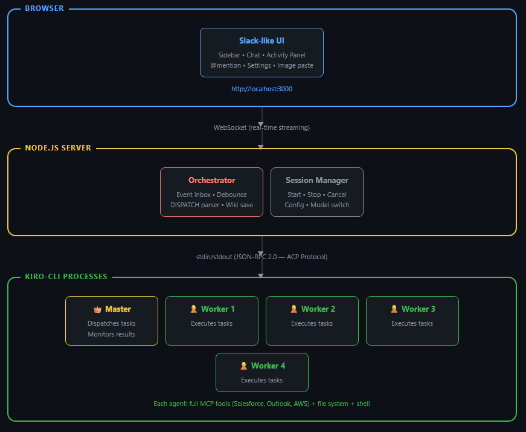
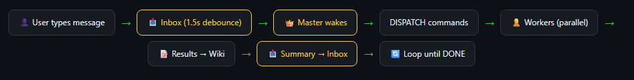
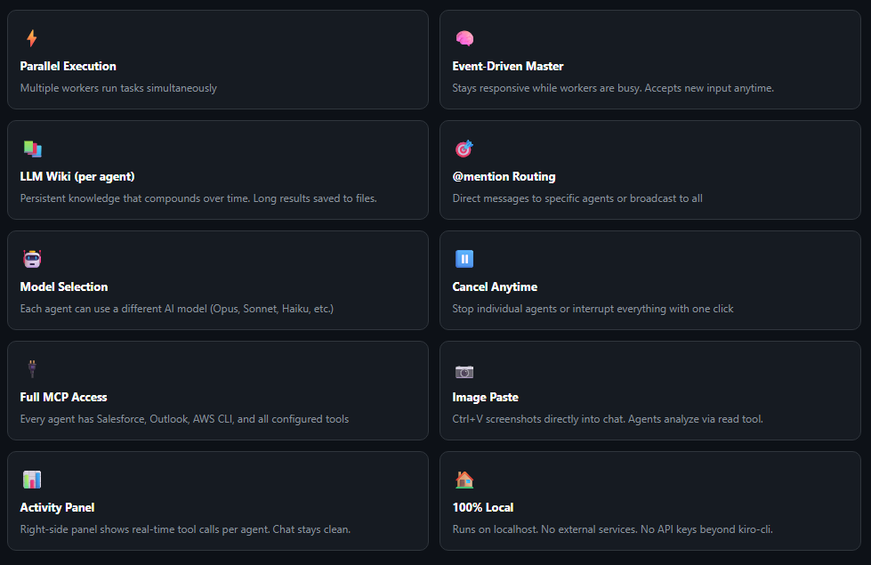

# 🎼 Kiro Orchestra

Local multi-agent orchestration UI — a Slack-like interface to command multiple kiro-cli workers in parallel.

You type a message, a Master agent dispatches tasks to workers, and you see all conversations in real-time. Each agent has its own persistent wiki for long-term memory.

## System Architecture



## Orchestration Flow



## Features



- **Parallel execution** — Workers run tasks simultaneously
- **Event-driven master** — Stays responsive while workers are busy; accepts new input anytime
- **Activity panel** — Right-side panel shows real-time tool calls per agent; chat stays clean
- **@mention routing** — `@Worker 1 do something` sends directly to that agent
- **Per-agent wiki** — Persistent knowledge (LLM Wiki pattern) that compounds over time
- **Model selection** — Each agent can use a different AI model (Opus, Sonnet, Haiku, etc.)
- **Image paste** — Ctrl+V screenshots into chat; agents analyze via read tool
- **Cancel anytime** — Type `stop` or click ⏸ to cancel individual agents or everything
- **Browser resume** — Refresh and conversation history is preserved (server-side buffer)
- **100% local** — Runs on localhost, no external services, no API keys beyond kiro-cli

## Quick Start

**Prerequisites:**
- [Node.js](https://nodejs.org/) 18+
- [kiro-cli](https://kiro.dev) installed and authenticated (`kiro-cli` in PATH)

```bash
git clone https://github.com/buddyxapp/kiro-orchestra.git
cd kiro-orchestra
npm install
npm start
```

Open http://localhost:3000 → Click ⚙️ Settings → Start agents → Chat!

## Usage

### Talk to Master (default)
```
help me process today's emails and check SFDC opportunities
```

### @mention specific agent
```
@Worker 1 count from 1 to 10
@Master what's the current status?
@all hello everyone
```

### Channel-aware routing
Click a channel in the sidebar → messages auto-route to that agent.

### Interrupt
```
stop
```
Or click ⏸ next to a working agent.

### Image paste
Ctrl+V a screenshot or click 📎 — the image is saved and the agent reads it.

## Configuration

| Env Variable | Default | Description |
|---|---|---|
| `PORT` | `3000` | Web server port |
| `KIRO_CMD` | `kiro-cli` | Path to kiro-cli |
| `KIRO_ARGS` | `acp --trust-all-tools` | kiro-cli arguments |
| `WORKSPACE` | Current directory | Base working directory for all agents |

## Tech Stack

- **Backend**: Node.js + TypeScript + [ws](https://github.com/websockets/ws)
- **Frontend**: Single HTML file, vanilla JS, no build step
- **AI**: kiro-cli via ACP protocol (JSON-RPC over stdin/stdout)
- **Knowledge**: Per-agent wiki directories ([LLM Wiki pattern](https://gist.github.com/karpathy/442a6bf555914893e9891c11519de94f))
- **Based on**: [OpenABWindows](https://github.com/buddyxapp/OpenABWindows) ACP modules

## MCP Tools

Every agent is a full kiro-cli instance with access to all your configured MCP servers (Salesforce, Outlook, AWS, etc.). Configure MCP in `~/.kiro/settings/mcp.json` as usual.

## License

MIT
